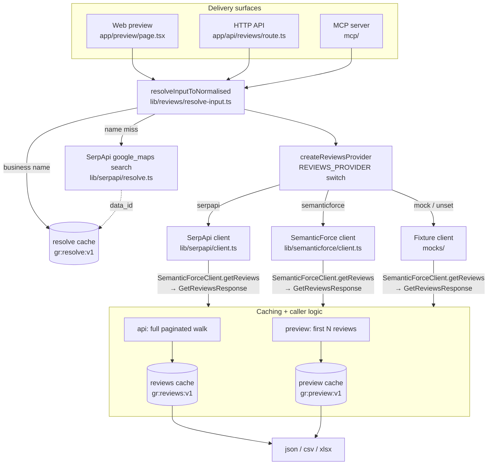

# Architecture

How the pieces fit together: one data-source switch, one client contract every
caller depends on, and three KV namespaces that keep partial and full results
from ever colliding. This is the design map for `lib/reviews/provider.ts`,
`lib/semanticforce/types.ts`, and `lib/cache/reviews-cache.ts`.

## The contract boundary — `SemanticForceClient`

Every delivery surface (web preview, HTTP API, MCP server) and every data
source talks through one interface, defined in `lib/semanticforce/types.ts`:

```ts
export interface SemanticForceClient {
  getReviews(args: GetReviewsArgs): Promise<GetReviewsResponse>;
}
```

`GetReviewsResponse` is `{ place: PlaceMeta; reviews: Review[]; next_cursor? }`.
The name is historical — SemanticForce was the original intended source — but the
interface is now the **internal contract**, not a vendor binding. SerpApi,
SemanticForce, and the fixture client each implement it and each map their raw
upstream shape onto `Review` / `PlaceMeta` *inside* the client, so no caller ever
sees a vendor's wire format. Errors are normalised too: every client throws
`SemanticForceError` carrying one of six `SemanticForceErrorCode`s
(`rate_limited | not_found | unauthorized | bad_request | upstream_error |
unknown`), which `lib/semanticforce/error-ux.ts` maps to visitor-safe copy
(D-100). Swapping the data source can therefore never leak a new error shape to
the UI.

This is the load-bearing decision (D-003 / D-084): callers depend on the
contract, never on a provider, so the source is a single env value away.

## The provider switch — `REVIEWS_PROVIDER`

`createReviewsProvider()` in `lib/reviews/provider.ts` reads one env var and
returns a `SemanticForceClient`. Callers (`app/api/reviews/route.ts`,
`app/preview/page.tsx`) construct through it and change nothing when the source
changes.

| `REVIEWS_PROVIDER` | Client | Network | Use |
|---|---|---|---|
| `serpapi` | `createSerpApiClient()` | live SerpApi | the trial data source (current) |
| `semanticforce` / `sf` | `createSemanticForceClient()` | live SemanticForce | intended production source |
| `mock` / unset / unknown | `createSemanticForceClient({ apiKey: "" })` | none — committed fixtures | offline default |

Two safety properties are deliberate:

- **Unknown → mock.** `resolveProviderName()` normalises anything it doesn't
  recognise to `mock`, so a misconfigured deploy degrades to fixture data, never
  a surprise live call.
- **Forced fixture mode.** The `mock` branch passes `apiKey: ""` explicitly. An
  empty string is falsy (so the SF client takes its no-key fixture branch) yet
  not nullish (so a `?? process.env.SF_API_KEY` fall-through can't silently
  re-enable live calls). Setting `REVIEWS_PROVIDER=mock` is a hard offline
  guarantee regardless of any ambient key.

## Request flow



The web preview and the API both classify their input the same way via
`resolveInputToNormalised`: a pasted **identifier** (Place ID, `0x…:0x…`
data_id, `MOCK_*` fixture id, or a Maps URL containing one) is normalised
directly; a free-text **business name** is resolved to a `data_id` through a
SerpApi `google_maps` search (`lib/serpapi/resolve.ts`), and that resolution is
cached so a repeat name lookup never burns a second search against the 750/mo
trial quota.

## The three cache namespaces

All three live in `lib/cache/reviews-cache.ts`, backed by **Vercel KV via its
REST API** in production and a **process-local `Map`** when the KV envs are unset
(the fixture default — no cache wiring needed to run end-to-end). The store is
dependency-free on purpose: it POSTs the KV REST pipeline form
(`["SET", key, value, "EX", ttl]`) rather than `@vercel/kv`, so it stays
edge-safe with no Node-only globals. TTL is **24h** for all three.

| Factory | Prefix | Holds | Why separate |
|---|---|---|---|
| `createReviewsCache` | `gr:reviews:v1:` | full paginated walk payload | the authoritative download |
| `createPreviewCache` | `gr:preview:v1:` | first-N-reviews preview payload | a partial preview must **never** be served to a full-walk download (D-089) |
| `createResolveCache` | `gr:resolve:v1:` | name → `data_id` (+ `PlaceMeta`) | protects the SerpApi search quota (L28.1) |

**Why preview and full are split** is the key invariant: the preview path fetches
only the first N reviews (it deliberately never paginates — D-031), while the API
walks every page. If both wrote the same key, a cheap preview could poison a
later full download with a truncated array. Distinct key spaces make that
impossible — the two never collide. The preview path also reads the *reviews*
cache first (a completed full download is richer than any preview), then its own
preview key, and only then makes one live call — so a place that's already been
downloaded previews for free.

The rate limiter uses the same KV store under a fourth prefix
(`gr:ratelimit:v1:`, `lib/ratelimit/kv-bucket.ts`) but is a cross-instance
token bucket, not a result cache — see `docs/deploy.md` for its fail-open /
non-atomic trade-offs (D-097).

## Where to look next

- Provider switch + fixture-forcing: `lib/reviews/provider.ts`
- The contract + error union: `lib/semanticforce/types.ts`
- KV REST cache + the three namespaces: `lib/cache/reviews-cache.ts`
- SerpApi mapping tables: `docs/serpapi-reviews.md`
- HTTP surface + pagination walk: `docs/api.md`, `app/api/reviews/route.ts`
- Deploy + rate-limit trade-offs: `docs/deploy.md`
